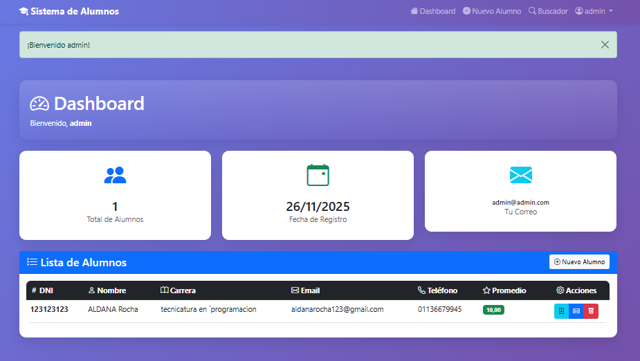
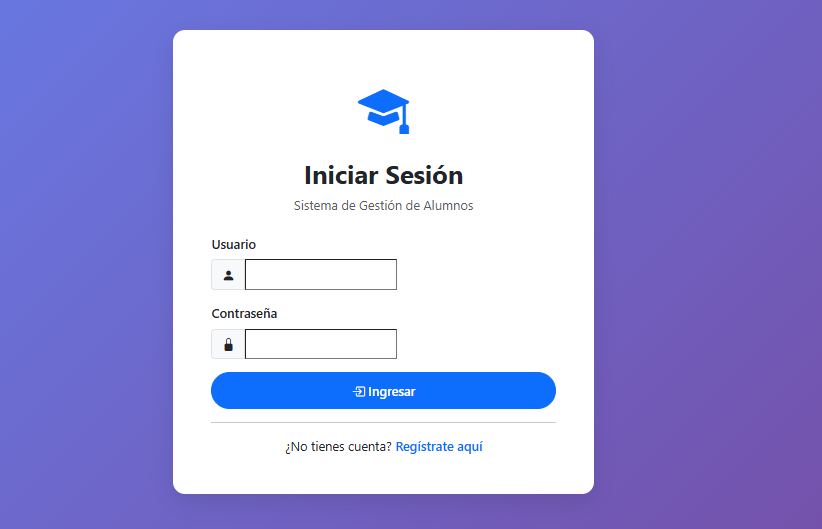
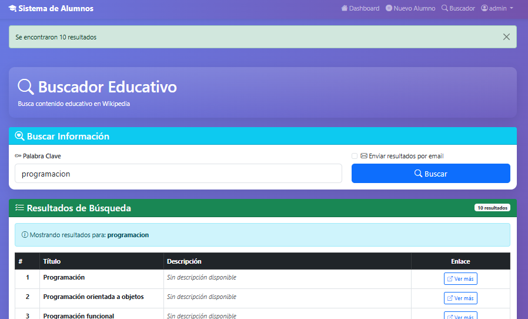
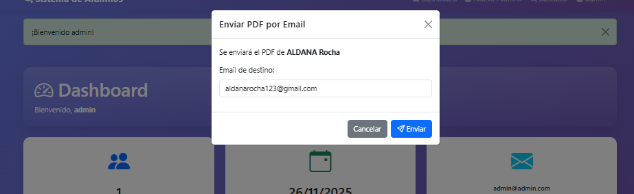

#🎓 Sistema de Gestión de Alumnos - Django

Este proyecto es una plataforma web para la gestión de alumnos, con funcionalidades de autenticación, manejo de datos de alumnos, generación de PDF, envío de correos electrónicos y un módulo básico de scraping educativo. El proyecto está desarrollado con Django, Bootstrap y se encuentra deployado en Render.

  

  

  

  

🔐 Login y Registro

🧑‍🎓 Dashboard de Alumnos

📄  Generación y envío de PDF

☁️ Deploy en Render

🔎 Scraping educativo básico

#⚙️ Tecnologías utilizadas

Backend: Django

Frontend: Bootstrap 5

Base de datos: SQLite (desarrollo) / PostgreSQL (producción en Render)

Generación de PDF: ReportLab / PyMuPDF

Correo: SMTP con Gmail

Deploy: Render

#🚀 Instalación y ejecución local

Clonar el repositorio:

git clone https://github.com/usuario/nombre-repo.git
cd nombre-repo

Crear y activar entorno virtual:

python -m venv venv
source venv/bin/activate  # Linux / macOS
venv\Scripts\activate     # Windows

Instalar dependencias:

pip install -r requirements.txt

Migrar base de datos:

python manage.py migrate

Crear superusuario:

python manage.py createsuperuser

(user: admin -- password:admin)

Ejecutar servidor local:

python manage.py runserver

📝 Notas finales

El proyecto incluye manejo de errores básicos y validaciones en formularios.

Para el scraping, se recomienda usar palabras clave genéricas para pruebas educativas.

Todos los correos y PDF generados se envían automáticamente según la configuración de SMTP.
